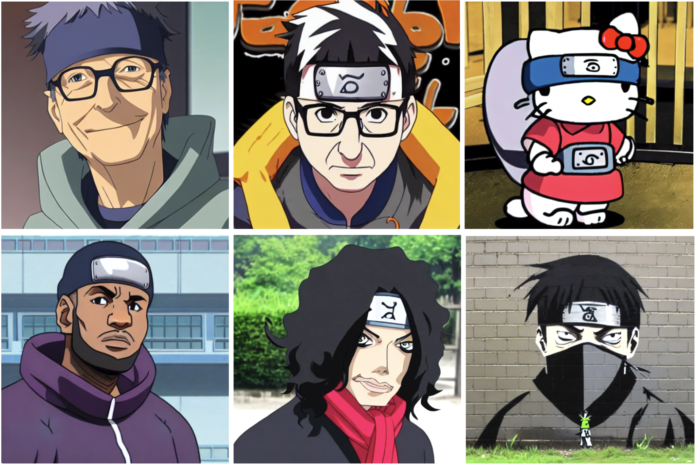

# Experiments with Stable Diffusion

This repository is a fork of Justin Pinkney's stable diffusion repository.  
It presents the use case of fine-tuning a text2image stable diffusion model with a BLIP captioned naruto face dataset.

For example generating new Naruto face from text:

> "Bill Gates with a hoodie", "John Oliver with Naruto style", "Hello Kitty with Naruto style", "Lebron James with a hat", "Mickael Jackson as a ninja", "Banksy Street art of ninja"

For a step by step guide see the [Lambda Labs examples repo](https://github.com/LambdaLabsML/examples).
